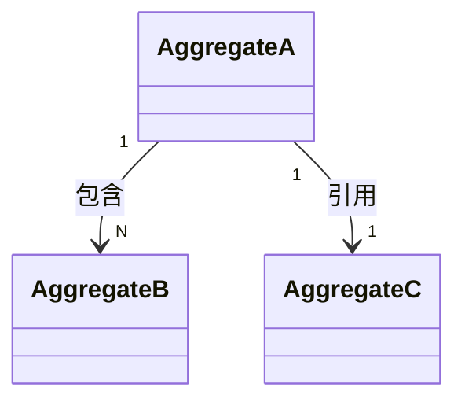

# Bob Model Skill

## 触发

```
/bob-model <doc-path>          # 主入口:对源需求文档建模
/bob-model --story <path>      # 退路:已有 stories 时反向建模
/bob-model --refresh           # 强制重写,即使源文档未变化
```

或自然语言触发:"建个模"、"做下领域建模"、"统一下术语"、"抽取业务规则"。

Codex:

```
$bob-model [文档路径]          # 主入口:对源需求文档建模
$bob-model --story [story 路径] # 退路:已有 stories 时反向建模
$bob-model --refresh           # 强制重写,即使源文档未变化
```

## 双宿主调用约定

- Claude Code 使用 `/bob-model`；Codex 使用 `$bob-model`，参数语义完全相同。
- 本文保留 slash 形式以保护 Claude Code 兼容性。
- 向用户给出下一步命令时，使用当前宿主的调用形式。
- 不从一个宿主的 skill 根回退到另一个宿主。

## 当前技能目录

- `<skill-dir>` 是当前宿主实际加载的 `SKILL.md` 所在目录的绝对路径，由当前宿主提供。
- 所有交互脚本只从 `<skill-dir>/scripts` 解析；找不到时报告已解析的完整路径并停止。
- 禁止回退到另一个宿主的 skill 根，也不得用另一个宿主的脚本副本补救。

## 宿主文档读取约定

- Claude Code：使用 `Read` 工具的 `pages` 参数分批读取 PDF/DOCX，保留现有分页读取流程。
- Codex：使用当前可用的 PDF/文档读取能力读取同一输入，保持相同的分批抽取目标。
- 当前所选宿主无法读取输入文档时，立即停止并清楚报告该输入无法由当前宿主读取；不得切换宿主或猜测内容。
- 后续抽取、建模与产物生成均由当前宿主代理执行。

## 前置条件

- 项目位于 git 仓库内
- 建议:`/bob-survey` 已完成 + 难度评估 Medium/Hard
- 源需求文档必须能由当前宿主读取；按“宿主文档读取约定”选择当前宿主的能力，无法读取时停止并报告。

## 提问规约(强制三段式)

任何需要用户选择的问题,**必须**按下面三段式输出。**禁止**抛开放问题。

格式:

> **[问题序号] [问题]**
>
> **推测**:<你的判断>
> **理由**:<一句话>
> **推荐选择**:`<具体一个选项>`
>
> 是否同意?(回"是"走推荐;回"否,理由是 ..."重判;回"否,我选 X"切到 X)

## 命名规约(强制表意,禁止光秃名词)

**理由**:术语表的英文列 = 下游 `/bob-spec` → TDD 阶段代码的**变量名 / 类型名直接候选**。光秃名词(`total` / `rate` / `time` / `discount` / `info`)会让人读到字段时无法判断它是钱、是数量、是时间、还是 boolean,在 spec 阶段需要重新命名,造成术语漂移和返工。**消除歧义优先于简洁**。

**通用心法**:**动词 + 名词 / 形容词 + 名词 / 修饰语 + 被动式** 组合,让命名自描述;不要让一个英文裸单词承担"判断它是什么类型"的认知负担。

### 核心原则(强制 · 普适)

每个名字必须让读者**脱离上下文**就能判断:**(a) 它是什么 type**(钱 / 数量 / 时间 / bool / 状态 / 结果 / 事件 / ...)和 **(b) 它的语义角色**(active / applied / computed / pending / ...)。光秃名词在两项上都失败。

通过 **POS 组合**(动词 + 名词 / 形容词 + 名词 / 修饰语 + 被动式)同时编码 (a) 和 (b)。**具体的后缀 / 前缀是领域约定**,**原则是普适的**——下面表里的具体词(`Fee` / `Rate` / `At` / `Quantity`)是电商 / 订单域示例,**换到其它域必须按本域自然约定灵活调整**(见后文「跨领域适用」)。

### 参考模式(电商/订单域示例,非穷举,按域灵活调整)

| 类别 | 反模式(禁) | 推荐模式 | 说明 |
|---|---|---|---|
| **金额** | `total` / `price` / `discount` / `cost`(裸) | `itemTotalFee` / `discountAmount` / `unitPrice` / `packingFee` | 用 `Fee` / `Amount` / `Price` / `Cost` 后缀,让"是钱"显式 |
| **比率** | `rate` / `ratio` | `discountRate` / `taxRate` / `commissionRate` | 用语义前缀 + `Rate`,说明"哪种比率" |
| **数量** | `num` / `cnt` / `count`(裸) | `itemQuantity` / `bonusQuantity` / `attemptCount` | 用限定词 + `Quantity` / `Count`,说明"几个什么" |
| **时间** | `time` / `date` | `createdAt` / `expiredAt` / `paidAt` | 用过去分词被动式 + `At`,说明"什么事件的时间" |
| **类型(归属型)** | `MerchantDiscount`(只说归属) | `ActiveDiscountPlan` —— 形容词 + 抽象名词 | 类型名应表达"状态 / 角色 / 结果",归属由 repository 携带(`ActiveDiscountPlanRepository.findByMerchantId`) |
| **类型(动作型)** | `Discount` / `Apply`(光秃) | `DiscountResult` / `ApplyDiscountCommand` / `AppliedDiscountSnapshot` | 用后缀(`Result` / `Command` / `Snapshot` / `Event`)消除"动词 vs 名词"歧义 |
| **Boolean** | `valid` / `discount` / `active` | `isValid` / `hasActiveDiscount` / `wasApplied` / `canCancel` | 用 `has` / `is` / `was` / `can` 前缀 + 形容词或被动式,让"是 bool"显式 |

### 跨领域适用(原则普适,具体词按域改)

上表是电商 / 订单域示例。换到其它域,**原则不变**——名字必须同时编码 type + role,禁止光秃名词——**但具体词必须换成本域自然量纲与角色**:

| 域 | 金额族 | 数量 / 度量族 | 时间族 | 类型族 |
|---|---|---|---|---|
| **物流 / 配送** | `shippingFeeAmount` / `codAmount` | `weightGram` / `weightKg` / `distanceKm` / `parcelCount` | `shippedAt` / `deliveredAt` / `signedAt` | `DeliveryStatusSnapshot` / `ActiveRouteAssignment` |
| **IoT / 设备** | (少金额) | `temperatureCelsius` / `batteryPercentage` / `signalRssi` | `lastPingedAt` / `lastChargedAt` | `DeviceHealthSnapshot` / `ActiveFirmwareImage` |
| **金融 / 账务** | `ledgerAmount` / `txnFeeAmount` | `shareCount` / `lotSize` | `settledAt` / `postedAt` / `accruedAt` | `PostedLedgerEntry` / `ActiveCounterparty` |
| **医疗 / 处方** | `prescriptionCharge` | `dosageMg` / `dosageMl` / `vialCount` | `prescribedAt` / `administeredAt` | `FilledPrescription` / `ActivePatientChart` |
| **教育 / LMS** | `tuitionFeeAmount` / `scholarshipAmount` | `enrolledCount` / `attemptCount` | `enrolledAt` / `submittedAt` / `gradedAt` | `SubmittedAssignment` / `ActiveEnrollmentPlan` |

**心法**:**不要照搬表里的具体词**——要复制表的**结构**:找到本域自然量纲(Kg / Km / Mg / Ml / Celsius / RSSI / ...),用 `xxxAt` 表达事件时间,用形容词 + 抽象名词表达类型角色。**普适规则只有一条:每个名字 = type + role 的显式编码。**

### Stage 1 抽取过程内自检(强制)

在写 §1 术语表之前,当前宿主代理对每一个候选名做三项自检:

1. **金额 / 比率 / 数量 / 时间字段**:有没有光秃名词?有就**直接重命名**,不抛 Q——这类歧义本规约已解决。
2. **类型名**:只表达"归属"或裸"概念"?如是,问自己"它是什么**状态 / 角色 / 结果**?",加形容词或语义后缀。
3. **脱离上下文测试**:任何字段名从术语表里抽出来单看,能否猜到 ≥ 80% 含义?不能就重命名。

自检发现的歧义**直接在 §1 给出表意名**——不要写出光秃名再用 Q 兜底。Q 留给"两种表意名都合理需用户拍板"的真歧义(三段式),不留给本规约可消除的。

### 违反 = 产出无效

本规约是 model 阶段的**硬约束**(配合"强制阶段不可跳过"不变量)。下游(stories / spec / TDD / code review)若收到含光秃名词的 model md,等价于 model 阶段没跑完——必须 `/bob-model --refresh` 重抽。Reviewer 接到 model md 时,**优先扫名词族**(grep 金额族 / 比率族 / 时间族 / Boolean 前缀)做形式校验。

## 产物报告规约(强制列出文件链接)

**每次** `/bob-model` 产出或更新文件后的报告中,**必须显式列出文件的绝对路径**(md + html),让用户能直接复制 / 浏览器打开 review。

### 必含项(任何"产物落盘"或"改动落点"的报告)

- url(浏览器打开):`http://localhost:<port>`(Stage 3.5 期间提供;Stage 4 后 server 已停,可忽略)
- screen_dir(html 本体):`/Users/.../03-model-<slug>-<date>-vN.html`(Stage 3.5 期间)
- md(SSoT):`/Users/.../docs/bob/03-model-<slug>-<date>.md`(Stage 4 起才存在)
- html(团队视图):`/Users/.../docs/bob/03-model-<slug>-<date>.html`(Stage 4 起从 screen_dir 复制)

### 格式示例

**改动报告(Stage 3.5 每一轮)**:

> 已应用本轮 N 条改动:
> - <kind:target>: <一行总结>
>
> **产物**(可直接打开 review):
> - url(浏览器打开):`http://localhost:<port>`
> - screen_dir(html 本体):`/Users/.../03-model-create-order-20260515-v2.html`

**Stage 4 收口三段式**:

> **Q: 建模完成。N 条术语 / ...**
>
> **产物**(review 直链):
> - md(SSoT):`/Users/.../docs/bob/03-model-create-order-20260515.md`
> - html(团队视图,浏览器打开):`/Users/.../docs/bob/03-model-create-order-20260515.html`
>
> **推测**:...
> **推荐选择**:...

### 明令禁止

- ❌ 只说"html 已落盘 / 已更新"而不给路径 —— 用户没法直接打开
- ❌ 只给相对路径(`docs/bob/...`)—— 用户在不同 cwd 时无法点击,IDE / 终端解析失败
- ❌ 把路径埋在散文里 —— 必须用 list / table 醒目展示
- ❌ 第二轮起省略路径 —— **每轮都要列**(即使路径没变),让用户随时定位
- ❌ 只列其中一个文件 —— md + html 两个都要(就算用户只用 html,md 仍是 SSoT 应保持可见)

### 为什么强制

用户在多轮修改循环(§Stage 3.5)中频繁需要打开 html 验证 Mermaid 图 / 长表格 / 跨域命名;每次都要翻历史消息找路径是摩擦。把路径作为"每轮报告标配"消除噪音。

## html widget 规范(Stage 2 compose 时必照)

每次 `/bob-model` Stage 2 生成 html 时,必须遵循以下结构 + 内嵌 CSS + 内嵌 JS。

### Page-level 骨架

    <!DOCTYPE html>
    <html lang="zh-CN">
    <head>
      <meta charset="UTF-8">
      <title>领域模型 · {{title}} · {{date}}</title>
      <script>
        window.BOB_MODEL_SLUG = '{{slug}}';
        window.BOB_MODEL_ROUND = {{round}};
      </script>
      <script src="https://cdn.jsdelivr.net/npm/mermaid@10/dist/mermaid.min.js"></script>
      <script>mermaid.initialize({ startOnLoad: true });</script>
      <style>/* 见 §CSS */</style>
    </head>
    <body>
      <header class="bob-sticky">
        <div class="title">{{title}} · round {{round}}</div>
        <div class="meta">
          <span class="counter-pill"><b id="draft-counter">0</b> 本轮草稿</span>
          <span class="counter-pill counter-submitted"><b id="submitted-counter">{{sessionSubmittedTotal}}</b> 累计已提交</span>
          <span class="counter-meta">/ 共 {{totalWidgets}} widget</span>
        </div>
        <div class="actions">
          <button id="clear-button">↻ 清空草稿</button>
          <button id="submit-button" disabled>📋 提交本轮反馈 (<span id="submit-count">0</span>)</button>
        </div>
      </header>
      <div class="bob-layout">
        <nav class="bob-toc">
          <a href="#sec-model">术语+Entity (6 聚合根 / 24 术语) <span class="section-badge" data-section-counter="model"></span></a>
          <a href="#sec-br">BR (14) <span class="section-badge" data-section-counter="br"></span></a>
          <a href="#sec-uc">UseCase (1) <span class="section-badge" data-section-counter="uc"></span></a>
          <a href="#sec-q">开放问题 (14) <span class="section-badge" data-section-counter="q"></span></a>
        </nav>
        <main class="bob-main">
          <!-- §1 术语+Entity(按聚合根分组,内含 §1 顶部关系图)/ §2 BR / §3 UC / §4 开放问题 -->
        </main>
      </div>
      <button class="bob-back-top" onclick="window.scrollTo({top:0, behavior:'smooth'})" aria-label="返回顶部">↑</button>
      <script>/* 见 §JS */</script>
    </body>
    </html>

### Widget DOM 模板

每个 widget 必须有 4 个 data-* 属性:`data-comment-id`(唯一,= `<kind>:<target>` 或 'general')、`data-kind`、`data-target`、`data-comment-count`(会话累计已提交评论数,当前宿主代理 compose 时从 events 反查注入,默认 `"0"`),以及一个 `.comment-input` textarea。

Widget 形态(按 §1 合并后的结构):

1. **聚合根块头 widget**(per `### <Aggregate>` 标题):块顶 💬,接收针对该聚合根整体的反馈(改名 / 拆分 / 合并 / 删除)。
2. **聚合根块内子段 widget**(关系 / 术语 / 属性 / **类图** / 状态机 / 不变量 / 生命周期 / 值对象关系 8 子段):每子段尾 💬,逐段独立反馈。其中**类图子段必出**,即使该聚合只有一个 entity 也要画。
3. **术语表行**(子段 3 表格内):每个 `<tr>` 末尾 💬,inline expand 行内反馈。
4. **BR 卡**(卡底 details):每张 BR 卡底 `<details>` 包 textarea。
5. **Mermaid 图**(图下 details):图块下 details/textarea,`data-target` 用图 slug。
6. **开放问题卡**(卡底 details):同 BR 卡;`data-target` 用 Q 编号。

### Widget 跨轮可编辑性(强制 · 这条 SKill 反复被违反,三重保险落地)

**所有 widget 在每一轮 push html 时都必须重置为「空草稿,可写,可提交」状态,任何情况下都不允许 lock / disabled / readonly / pointer-events:none / 点不开**:

- 上一轮提交并被当前宿主代理应用的反馈 → 本轮该 widget 的 textarea **清空 + 计数归 0 + 按钮可点击**,允许用户继续提新反馈
- localStorage 草稿在"本轮提交完成"后清掉,但 widget 本身保持可写
- 视觉上"曾在第 N 轮被修改过"的痕迹**只是提示**(可用 `data-modified-round="N"` + 浅色虚线边框 / 角标),**不影响交互**:点击仍展开 textarea,仍能输入,仍能提交
- **禁止**任何"已应用,不可再改"的 UI 状态;建模阶段的本质是多轮逼近,任何字段都可能在第 N 轮才稳定

#### 反模式黑名单(以下任何一项出现都算 skill 违反)

| 反模式 | 错误示例 | 后果 |
|---|---|---|
| CSS 屏蔽点击 | `.bob-widget[data-modified-round] { pointer-events: none; }` | 用户看到虚线 widget 但点不开 |
| Click handler early-return | `if (widget.dataset.modifiedRound) return;` | 同上 |
| textarea 加只读属性 | `<textarea disabled>` / `<textarea readonly>` | 能点开但不能输入 |
| 按钮被换成 span | `<span class="comment-toggle">💬</span>` | 失去 native click 语义 |
| 整体替换为静态文本 | 把 widget DOM 整个换成 `<span>已应用 ✓</span>` | 用户彻底失去交互入口 |
| user-select 屏蔽 | `.comment-input { user-select: none; }` | 能点开但选不到文字 |

#### 可拷贝的 canonical 实现(当前宿主代理 compose 时**直接抄,不要重写**)

**CSS**(visual hint only,不动 interaction):

```css
/* === 状态 A:空态(默认)=== 灰虚线 💬 0 */
.bob-widget .comment-toggle {
  border: 1px dashed var(--border-strong, #d1d5db);
  background: transparent;
  color: var(--text-muted, #9ca3af);
}

/* === 状态 B:本轮有未提交草稿 === 蓝实线 */
.bob-widget .comment-toggle.has-draft {
  border: 1px solid var(--accent, #2563eb);
  background: var(--accent-soft, #dbeafe);
  color: var(--accent, #2563eb);
}

/* === 状态 C:累计 ≥ 1 条已提交评论 === 绿实底 💬 N(覆盖默认空态)*/
.bob-widget:not([data-comment-count="0"]) .comment-toggle {
  border: 1px solid var(--success, #10b981);
  background: var(--success-bg, #d1fae5);
  color: var(--success-text, #065f46);
  font-weight: 600;
}

/* === 状态 D:既累计有评论,本轮又新加草稿 === 绿底 + 蓝边 */
.bob-widget:not([data-comment-count="0"]) .comment-toggle.has-draft {
  border-color: var(--accent, #2563eb);
}

/* 注意:任何状态都不要加 pointer-events / opacity / cursor:not-allowed */
```

**计数显示**:绿色状态(状态 C/D)下,`.count` span 显示该 widget 的累计 submitted 数(从 `data-comment-count` 读)。空态下显示 0。**JS 必须同步**:每次重渲染时根据 `data-comment-count` 设置 `.count` 文本。

**JS**(统一 click handler + 初始化 count badge,**不分** comment-count 是否 0):

```js
// 初始化:把每个 widget 的 data-comment-count 同步到 .count 文本
function syncCommentCounts() {
  document.querySelectorAll('.bob-widget').forEach((w) => {
    const cntEl = w.querySelector('.count');
    if (cntEl) cntEl.textContent = w.dataset.commentCount || '0';
  });
}
syncCommentCounts();

// 顶部 submitted-counter:遍历所有 widget,把 data-comment-count 累加显示
function syncSubmittedTotal() {
  let total = 0;
  document.querySelectorAll('.bob-widget').forEach((w) => {
    total += parseInt(w.dataset.commentCount || '0', 10);
  });
  const el = document.getElementById('submitted-counter');
  if (el) el.textContent = String(total);
}
syncSubmittedTotal();

// 统一 click handler — 任何状态都展开 textarea
document.addEventListener('click', (e) => {
  const toggle = e.target.closest('.comment-toggle');
  if (!toggle) return;
  const widget = toggle.closest('.bob-widget');
  if (!widget) return;
  const ta = widget.querySelector('.comment-input');
  if (!ta) return;
  ta.classList.toggle('show');
  if (ta.classList.contains('show')) ta.focus();
  // 注意:没有任何 if (widget.dataset.commentCount > 0) return 之类的分支
});
```

**重置函数**(每轮 push 新 html 时,server 重发 html 自动 reload,localStorage 清掉,widget DOM 重建,**不需要**特别 reset 逻辑;但若 SPA 化未来不 reload,则必须实现):

```js
function resetWidgetsForNewRound() {
  document.querySelectorAll('.bob-widget').forEach((w) => {
    const ta = w.querySelector('.comment-input');
    if (ta) {
      ta.value = '';
      ta.classList.remove('show');
      ta.removeAttribute('disabled');   // 防御性清除
      ta.removeAttribute('readonly');   // 防御性清除
    }
    const cnt = w.querySelector('.count');
    if (cnt) cnt.textContent = '0';
    const tog = w.querySelector('.comment-toggle');
    if (tog) tog.classList.remove('has-draft');
    // 保留 data-modified-round 数据属性,只用于视觉提示
  });
}
```

#### Stage 2 自检清单(compose 完 HTML 必须自查 + 在 Stage 3 通报里显式承诺)

当前宿主代理在 Stage 3 启 server / push html 时,通报段必须包含以下 3 行勾选(用真实结果填):

```
✓ 已检查:所有 widget 的 click handler 都来自 canonical 片段,无 modified-round 分支
✓ 已检查:CSS 中 .bob-widget / .comment-toggle / .comment-input 选择器无 pointer-events / user-select / opacity:0 / disabled 屏蔽
✓ 已检查:所有 textarea 无 disabled / readonly 属性;所有 .comment-toggle 是 <button>
✓ 已检查:**每个聚合根 H3 块内都有 Entity 类图,且画法符合阈值**(class ≤ 10 单图全展开 / > 10 切骨架+详图;骨架自身 class ≤ 10;每个非平凡 VO 有详图;`<<value object>>` 出现次数 = 详图数 + 单字段 inline 注释数 — 任何 VO 既无详图又无 inline = 违规)
```

任一勾不上 = 本阶段未完成,需立即修改 HTML 重新 push。

### 布局与导航(粘性 TOC)

- 顶部 `header.bob-sticky`(sticky 定位)固定可见,含计数 + 提交按钮
- 左侧 `nav.bob-toc` **粘性 TOC**(`position: sticky; top: 56px`),4 节锚点(术语+Entity / BR / UC / 开放问题)+ 每节 draft 红角标
- 主内容区 `main.bob-main` 滚动区
- 右下浮动 `.bob-back-top` 返顶按钮

### Q 卡两态(强制)

§4 开放问题区的每张 Q 卡**有状态**(per §1.3 §E),html 必须按状态切换视觉。**两态都仍带 💬 widget,可继续提反馈**(per §Widget 跨轮可编辑性)。

#### 未决议态(default · 红/橙左边框)

```html
<div class="q-card q-unresolved" id="q-Q5" data-q-state="unresolved">
  <h4>Q5 <span class="q-text">客户端传的 foodItemName / foodItemUnitPrice 与 Merchant 当前值不一致时?</span></h4>
  <p class="q-impact">影响:spec</p>
  <div class="q-tentative">暂定:A — 系统忽略客户端值,以 Merchant 为准 snapshot</div>
  <details><summary>💬 评论此问题</summary>
    <span class="bob-widget" data-comment-id="q:Q5" data-kind="q" data-target="Q5" data-section="q" data-comment-count="0">
      <textarea class="comment-input show"></textarea>
    </span>
  </details>
</div>
```

#### 已决议态(Round N 拍板 · 绿左边框 + ✅)

```html
<div class="q-card q-resolved" id="q-Q3" data-q-state="resolved" data-resolved-round="4">
  <h4>Q3 ✅ <span class="q-text">订单超时未支付是否自动取消?</span></h4>
  <p class="q-impact">影响:后续 story</p>
  <div class="q-resolution">
    ✅ <b>决议(Round 4)</b>:<b>不取消</b>(本需求 + 后续 story 均不实现自动 / 手动取消)。状态机因此无 CANCELLED 节点,linear 5 状态闭合。
  </div>
  <details><summary>💬 评论此问题</summary>
    <span class="bob-widget" data-comment-id="q:Q3" data-kind="q" data-target="Q3" data-section="q" data-comment-count="0">
      <textarea class="comment-input show"></textarea>
    </span>
  </details>
</div>
```

带反链(决议落到新 BR / 字段时)版本:

```html
<div class="q-resolution">
  ✅ <b>决议(Round 4)</b>:仅校验 <code>recipientPhoneNumber</code> 格式 ...;落到新 <a href="#br-BR-019">BR-019</a>。
</div>
```

#### CSS(canonical · 直接拷)

```css
.q-card { border: 1px solid var(--border); border-radius: 6px; padding: 12px 16px; margin: 12px 0; background: var(--bg); }
.q-card.q-unresolved { border-left: 5px solid var(--unresolved, #ef4444); }
.q-card.q-resolved   { border-left: 5px solid var(--success,    #10b981); }
.q-card h4 { margin: 0 0 4px; font-size: 15px; }
.q-card .q-impact { color: var(--text-muted); font-size: 12px; margin: 0 0 8px; }
.q-card .q-tentative { background: #eff6ff; border-radius: 4px; padding: 8px 12px; font-size: 13px; }
.q-card .q-resolution {
  background: #d1fae5;
  border-radius: 4px;
  padding: 10px 14px;
  font-size: 13px;
  line-height: 1.6;
}
.q-card .q-resolution b { color: #065f46; }
/* 注意:.q-resolved 仍允许底部 💬 widget 完全交互,per re-editability 规则 */
```

#### 状态切换规约

- Stage 1.3 §E 表里 unresolved 行 → 渲染未决议态;resolved 行 → 渲染已决议态(用表里的"决议 / 决议轮次 / 决议反链到"字段填模板)
- Stage 3.5.2 用户对某 Q 给出明确决议(kind=`q` 反馈,语义清晰非"再想想")→ 当前宿主代理内部模型快照更新 `resolved=true` + 三字段 → 下一轮 compose 时该 Q 自动切到已决议态
- 用户后续若反悔 / 推翻决议 → 通过 💬 widget 再提反馈 → 当前宿主代理可把 resolved 回退到 unresolved(`resolved=false`,清空决议字段),也可保持 resolved 但更新 resolution 内容

### Mermaid 图清单(每节用什么类型)

| 出现位置 | Mermaid 类型 | 用途 |
|---|---|---|
| §1 顶部 overview(聚合根 ≥ 3 时可选) | `classDiagram` | 跨聚合根关系鸟瞰,只画基数 + 包含/引用;**关系细节不靠这张图传递**,以 §1 各聚合根块内 inline 文字为准 |
| §1 各聚合根块 Entity 类图(**强制**,每聚合根至少一张) | `classDiagram` | 该聚合根 + 内嵌实体/值对象的属性 class 块 + `<<value object>>` / `<<entity>>` / `<<enum>>` 注解。**画法按 class 总数决定**:≤ 10 单图全展开;> 10 切「骨架 + 详图」两层(骨架仅画名字,深度=1;每个非平凡 VO 一张详图,深度=1)。平凡 VO(单字段包装)只在骨架 inline 标注,enum 取值不列。详见 §1.3 A.2 第 2 项 |
| §1 各聚合根块 状态机种子 | `stateDiagram-v2` | 已出现状态用实线 `-->`,未确认状态用虚线 `..>` |
| §3 UseCase 流程 | `flowchart TD` 或 `flowchart LR` | 流程图,展示 UseCase 内部 step 串联 / 分支逻辑 |

每张图都包在 `<pre><code class="language-mermaid">...</code></pre>` 内便于离线降级,同时下方 `<div class="mermaid">...</div>` 让 CDN Mermaid 渲染。

统一格式(以 term 为例):

    <div class="bob-widget" data-comment-id="term:discountRate" data-kind="term" data-target="discountRate" data-section="terms">
      <button class="comment-toggle">💬 <span class="count">0</span></button>
      <textarea class="comment-input" placeholder="对此 term 的修改意见..."></textarea>
    </div>

### CSS(嵌 head 内 <style>)

    :root {
      --c-untouched: #d0d7de;
      --c-draft: #0969da;
      --c-submitted: #1a7f37;
      --c-applied: #57606a;
      --c-bg: #fafbfc;
      --c-fg: #1f2328;
    }
    * { box-sizing: border-box; }
    body { margin: 0; font-family: -apple-system, BlinkMacSystemFont, "PingFang SC", "Microsoft YaHei", sans-serif; background: var(--c-bg); color: var(--c-fg); }
    .bob-sticky { position: sticky; top: 0; z-index: 100; background: var(--c-draft); color: white; padding: 12px 16px; display: flex; align-items: center; gap: 16px; }
    .bob-sticky .title { font-weight: 700; font-size: 16px; }
    .bob-sticky .meta { opacity: 0.85; font-size: 13px; }
    .bob-sticky .actions { margin-left: auto; display: flex; gap: 8px; }
    .bob-sticky button { padding: 4px 12px; border-radius: 4px; border: 1px solid rgba(255,255,255,0.4); background: rgba(255,255,255,0.2); color: white; cursor: pointer; font-size: 13px; }
    .bob-sticky #submit-button:not(:disabled) { background: white; color: var(--c-draft); font-weight: 600; }
    .bob-sticky #submit-button:disabled { opacity: 0.5; cursor: not-allowed; }
    .bob-layout { display: flex; max-width: 1280px; margin: 0 auto; }
    .bob-toc { width: 220px; padding: 16px; font-size: 13px; position: sticky; top: 56px; align-self: flex-start; max-height: calc(100vh - 56px); overflow-y: auto; border-right: 1px solid var(--c-untouched); }
    .bob-toc a { display: block; padding: 4px 8px; color: var(--c-fg); text-decoration: none; border-radius: 4px; }
    .bob-toc a:hover { background: #ddf4ff; color: var(--c-draft); }
    .bob-toc .section-badge { display: inline-block; background: var(--c-draft); color: white; font-size: 11px; padding: 0 6px; border-radius: 8px; margin-left: 4px; }
    .bob-toc .section-badge:empty { display: none; }
    .bob-main { flex: 1; padding: 16px 40px 80px; }
    .bob-widget { position: relative; }
    .bob-widget .comment-toggle { background: transparent; border: 1px solid var(--c-untouched); padding: 2px 8px; border-radius: 12px; font-size: 11px; cursor: pointer; color: var(--c-fg); }
    .bob-widget.expanded .comment-toggle { background: var(--c-draft); color: white; border-color: var(--c-draft); }
    .bob-widget .comment-input { width: 100%; min-height: 60px; margin-top: 8px; padding: 8px; border: 2px solid var(--c-untouched); border-radius: 4px; font-size: 13px; resize: vertical; display: none; }
    .bob-widget.expanded .comment-input { display: block; }
    .bob-widget.state-draft .comment-input { border-color: var(--c-draft); background: #ddf4ff; }
    .bob-widget.state-submitted .comment-input { border-color: var(--c-submitted); background: #dafbe1; display: none; }
    .bob-widget.state-submitted .comment-toggle { background: var(--c-submitted); color: white; border-color: var(--c-submitted); }
    .bob-widget.state-submitted .comment-toggle::after { content: ' ✓'; }
    .bob-widget.state-applied { opacity: 0.6; }
    .bob-widget.state-applied .comment-toggle { background: transparent; color: var(--c-applied); border: 2px dashed var(--c-applied); }
    .bob-widget.state-applied .comment-input { border: 2px dashed var(--c-applied); background: #f6f8fa; color: var(--c-applied); display: none; }
    .bob-toast { position: fixed; bottom: 24px; left: 50%; transform: translateX(-50%) translateY(80px); background: #1f2328; color: white; padding: 10px 18px; border-radius: 6px; font-size: 13px; box-shadow: 0 4px 12px rgba(0,0,0,0.15); transition: transform 0.3s ease; z-index: 200; }
    .bob-toast.show { transform: translateX(-50%) translateY(0); }
    .bob-back-top { position: fixed; right: 24px; bottom: 24px; width: 40px; height: 40px; border-radius: 20px; background: var(--c-draft); color: white; border: none; cursor: pointer; box-shadow: 0 4px 12px rgba(0,0,0,0.15); }

### JS(嵌 body 末 <script>)

    // bob-model interactive review · page helper (inline, no module system)
    // Globals expected: window.BOB_MODEL_SLUG (str), window.BOB_MODEL_ROUND (int)
    (function() {
      if (!window.BOB_MODEL_SLUG) { console.error('BOB_MODEL_SLUG missing'); return; }
      const SLUG = window.BOB_MODEL_SLUG;
      const DRAFTS_KEY = `bob-model:${SLUG}:drafts`;
      const SUBMITTED_KEY = `bob-model:${SLUG}:submitted`;
    
      // -- localStorage helpers --
      const loadDrafts = () => {
        try { return JSON.parse(localStorage.getItem(DRAFTS_KEY) || '{}'); }
        catch (e) { console.warn('drafts localStorage corrupted, resetting:', e); return {}; }
      };
      const saveDrafts = (d) => localStorage.setItem(DRAFTS_KEY, JSON.stringify(d));
      const loadSubmitted = () => {
        try { return JSON.parse(localStorage.getItem(SUBMITTED_KEY) || '[]'); }
        catch (e) { console.warn('submitted localStorage corrupted, resetting:', e); return []; }
      };
      const saveSubmitted = (s) => localStorage.setItem(SUBMITTED_KEY, JSON.stringify(s));
    
      // -- widget key (= comment-id) helpers --
      function widgetKey(widget) {
        return widget.dataset.commentId;
      }
      function setState(widget, state) {
        widget.classList.remove('state-untouched', 'state-draft', 'state-submitted', 'state-applied');
        widget.classList.add('state-' + state);
      }
    
      // -- hydrate UI from localStorage on page load --
      function hydrate() {
        const drafts = loadDrafts();
        const submitted = new Set(loadSubmitted());
        const cleanedSubmitted = new Set(submitted);
    
        document.querySelectorAll('[data-comment-id]').forEach(widget => {
          const key = widgetKey(widget);
          const textarea = widget.querySelector('.comment-input');
    
          if (widget.hasAttribute('data-applied')) {
            setState(widget, 'applied');
            cleanedSubmitted.delete(key);
            return;
          }
    
          if (submitted.has(key)) {
            setState(widget, 'submitted');
            return;
          }
    
          if (drafts[key]) {
            if (textarea) textarea.value = drafts[key];
            setState(widget, 'draft');
            return;
          }
    
          setState(widget, 'untouched');
        });
    
        saveSubmitted([...cleanedSubmitted]);
        updateCounter();
      }
    
      // -- debounced auto-save on input --
      const saveTimers = new Map();
      function setupAutoSave() {
        document.querySelectorAll('.comment-input').forEach(textarea => {
          textarea.addEventListener('input', () => {
            const widget = textarea.closest('[data-comment-id]');
            const key = widgetKey(widget);
            if (saveTimers.has(key)) clearTimeout(saveTimers.get(key));
            saveTimers.set(key, setTimeout(() => {
              const drafts = loadDrafts();
              const val = textarea.value.trim();
              if (val) {
                drafts[key] = textarea.value;
                setState(widget, 'draft');
              } else {
                delete drafts[key];
                setState(widget, 'untouched');
              }
              saveDrafts(drafts);
              updateCounter();
            }, 500));
          });
        });
      }
    
      // -- sticky counter + submit button enable + per-section counters --
      function updateCounter() {
        const draftCount = document.querySelectorAll('.state-draft').length;
        const counterEl = document.getElementById('draft-counter');
        const submitBtn = document.getElementById('submit-button');
        if (counterEl) counterEl.textContent = draftCount;
        if (submitBtn) submitBtn.disabled = draftCount === 0;
    
        // Per-widget count badge: 1 if widget has content (draft or submitted), 0 if untouched/applied
        document.querySelectorAll('[data-comment-id]').forEach(widget => {
          const countEl = widget.querySelector('.comment-toggle .count');
          if (countEl) {
            const hasContent = widget.classList.contains('state-draft') || widget.classList.contains('state-submitted');
            countEl.textContent = hasContent ? '1' : '0';
          }
        });
    
        const sectionCounts = {};
        document.querySelectorAll('.state-draft').forEach(w => {
          const section = w.dataset.section;
          if (section) sectionCounts[section] = (sectionCounts[section] || 0) + 1;
        });
        document.querySelectorAll('[data-section-counter]').forEach(el => {
          const sec = el.dataset.sectionCounter;
          const c = sectionCounts[sec] || 0;
          el.textContent = c > 0 ? '●' + c : '';
        });
      }
    
      // -- collect feedback envelope --
      function collectFeedback() {
        const drafts = loadDrafts();
        const ts = Date.now();
        const comments = Object.entries(drafts).map(([key, comment], i) => {
          const widget = document.querySelector(`[data-comment-id="${CSS.escape(key)}"]`);
          if (!widget) {
            console.warn('orphaned draft key has no widget; skipping:', key);
            return null;
          }
          const kind = widget.dataset.kind;
          const target = widget.dataset.target || null;
          return {
            id: `c-${ts}-${String(i + 1).padStart(3, '0')}`,
            kind,
            target,
            comment
          };
        }).filter(Boolean);
        return {
          type: 'bob-model-feedback',
          choice: 'submit',
          slug: SLUG,
          round: parseInt(window.BOB_MODEL_ROUND || '1', 10),
          timestamp: ts,
          comments
        };
      }
    
      // -- submit via window.bobReview.send --
      function submitFeedback() {
        const envelope = collectFeedback();
        if (envelope.comments.length === 0) return;
    
        if (!window.bobReview || !window.bobReview.send) {
          showToast('WebSocket helper 未加载 (页面可能未通过 server 访问)');
          return;
        }
        try {
          window.bobReview.send(envelope);
          const submitted = loadSubmitted();
          envelope.comments.forEach(c => {
            const key = c.kind === 'general' ? 'general' : `${c.kind}:${c.target}`;
            if (!submitted.includes(key)) submitted.push(key);
          });
          saveSubmitted(submitted);
          saveDrafts({});
    
          document.querySelectorAll('.state-draft').forEach(w => setState(w, 'submitted'));
          updateCounter();
          showToast(`已提交 ${envelope.comments.length} 条反馈,等当前宿主代理处理`);
        } catch (e) {
          showToast(`提交失败: ${e.message}`);
        }
      }
    
      function clearDrafts() {
        if (!confirm('清空所有未提交草稿?(已提交不受影响)')) return;
        saveDrafts({});
        document.querySelectorAll('.state-draft').forEach(w => {
          setState(w, 'untouched');
          const ta = w.querySelector('.comment-input');
          if (ta) ta.value = '';
        });
        updateCounter();
      }
    
      function showToast(msg) {
        const t = document.createElement('div');
        t.className = 'bob-toast';
        t.textContent = msg;
        document.body.appendChild(t);
        setTimeout(() => t.classList.add('show'), 10);
        setTimeout(() => { t.classList.remove('show'); setTimeout(() => t.remove(), 300); }, 3000);
      }
    
      function setupToggles() {
        document.querySelectorAll('.comment-toggle').forEach(btn => {
          btn.addEventListener('click', () => {
            const widget = btn.closest('[data-comment-id]');
            widget.classList.toggle('expanded');
          });
        });
      }
    
      document.addEventListener('DOMContentLoaded', () => {
        hydrate();
        setupAutoSave();
        setupToggles();
        const sb = document.getElementById('submit-button');
        const cb = document.getElementById('clear-button');
        if (sb) sb.addEventListener('click', submitFeedback);
        if (cb) cb.addEventListener('click', clearDrafts);
      });
    })();

### 不变量

- 每个 widget 必有 `data-comment-id` / `data-kind` / `data-target` / `data-section`
- 所有 cross-ref 必须是 `<a href="#br-001">BR-001</a>` 格式(自动生成,当前宿主代理 compose 时正则替换)
- Stage 4 dump md 时,**自动 strip** 所有 widget DOM(只保留语义内容)→ md 干净

## 评论协议与 schema(Stage 3.5 必照)

### Envelope schema(WebSocket message via window.bobReview.send / events JSONL 行)

    {
      "type": "bob-model-feedback",
      "choice": "submit",
      "slug": "create-order",
      "round": 2,
      "timestamp": 1778820000000,
      "comments": [
        {"id": "c-1778820000000-001", "kind": "term", "target": "discountRate", "comment": "..."},
        {"id": "c-1778820000000-002", "kind": "entity-field", "target": "Order.totalAmount", "comment": "..."},
        {"id": "c-1778820000000-003", "kind": "br", "target": "BR-010", "comment": "..."},
        {"id": "c-1778820000000-004", "kind": "diagram", "target": "order-state-machine", "comment": "..."},
        {"id": "c-1778820000000-005", "kind": "open-question", "target": "Q14", "comment": "..."},
        {"id": "c-1778820000000-006", "kind": "general", "target": null, "comment": "..."}
      ]
    }

### 6 种 kind × 当前宿主代理处理

| kind | target 格式 | 当前宿主代理处理 |
|---|---|---|
| `term` | 英文名 e.g. `discountRate` | 改术语行(改名/改定义/加同义词);改名 → 自动级联所有 BR / Entity / Q 引用 |
| `entity-field` | `Entity.field` e.g. `Order.totalAmount` | 改字段(改名/改类型/改必填/加不变量);改名 → 级联 |
| `br` | `BR-NNN` | 改公式/约束/来源/删/合并 |
| `diagram` | 图 slug e.g. `order-state-machine` | 重画 Mermaid |
| `open-question` | `QN` | 决议落 BR / 改暂定 / 拆分 |
| `general` | `null` | **先三段式**确认意图再动手 |

### 幂等与增量

- `last_processed_event_timestamp`(当前宿主代理内部 model snapshot 状态)
- `processed_comment_ids` set(兜底防 timestamp 错位)
- 每轮处理完更新两者

### 自由文本兜底

意图清晰(`kind=br / target=BR-010 / comment="rate=1 也应该允许"`)→ **直接执行**。

意图不清(`kind=general / "BR 数太多了"` 或含 "看能否 / 我觉得 / 也许")→ **先三段式确认**(给 1 个推测 + 影响范围),用户回 OK 才动手。

## 目标

**翻译**散文需求文档为下游可消费的领域模型快照。只回答两个问题:

1. **这份需求里的术语 / Entity / 业务规则 / UseCase 各是什么?**
2. **PM 没说清楚、需要交给 `/bob-spec` 进一步消化的开放问题有哪些?**

**不写代码、不切 story、不画架构**。产出一份**交互式 html**(Stage 2-3.5,review canvas)+ 一份 md(Stage 4 dump,SSoT)。

## 工作流(6 个 Stage)

```
Stage 0. 入口体检 + 短路判定(可跳过建模)
Stage 1. 抽取(领域核心)
  1.1 读源文档
  1.2 识别聚合根(终端 mini-loop 多轮反馈,纯文本,不写盘 / 不出 html)— ★ model 阶段最重要的工作
  1.3 基于已确认聚合根展开完整抽取(按聚合根分组的术语+Entity 一体 / BR / UC / Q)
  1.4 三段式确认完整抽取结果
Stage 2. 生成 interactive html 内容(当前宿主代理在内存里 compose,按聚合根组织)
Stage 3. 启 visual companion server + push html + 给用户 URL
Stage 3.5. 多轮修改循环(event-driven,默认进入)
Stage 4. 三段式收口(用户给推进信号 → dump md → 停 server)
```

---

## Stage 0. 入口体检 + 短路判定

读取并通报:

| 状态 | 判定条件 | 后续行为 |
|---|---|---|
| **缺输入** | 无 `<doc-path>` 参数 + 无 `--story` + 找不到 survey 的源文档引用 | 拒绝运行,提示用户提供文档路径 |
| **极小需求** | 文档体量 < 50 行 + 概念 ≤ 3 + 无跨 story 共享规则 | 三段式询问"短路:写占位 md 后继续"。用户同意则写**一份占位 md** 留痕(空段 + 短路理由)。**model 阶段视为已完成**,下游 stories 门禁通过 |
| **常规** | 其他 | → Stage 1 |

向用户三段式通报:

> **Q0: 这份需求按哪种模式建模?**
>
> **推测**:常规 / 极小需求 / 缺输入
> **理由**:`<具体证据:行数 / 概念数 / 跨 story 共享规则数>`
> **推荐选择**:`继续建模(常规)` / `短路(写占位 md 后继续)` / `补充输入`
>
> 是否同意?

> **不变量**:**短路**分支 → Stage 0 立刻写一份**占位 md**(`docs/bob/03-model-<slug>-<date>.md`)+ 退出;**常规**分支 → md 不在此处写,会在 **Stage 4 推进**时从最终 html 状态 dump。无论哪条路径,最终都会落 md;下游 `/bob-stories` 在 Stage 0 硬校验本文件存在。"短路"≠"跳过 model" —— 它只是把内容压缩到占位 md。

输出文件名计算:
- `<slug>` = 当前宿主代理从源文档名 + 业务语义生成的 3-5 字符 kebab-case 标识符(如 "ycb需求.md" + 业务"创建订单" → "create-order");**同一 slug 贯穿 Stage 0/2/3/4 所有阶段**(短路占位 md / 交互式 html / Stage 4 dump 都用此值)
- `<date>` = `YYYYMMDD`(UTC)
- 输出:`docs/bob/03-model-<slug>-<date>.md` + `docs/bob/03-model-<slug>-<date>.html`
- **同一天再跑** → 覆盖同名文件;**跨天** → 新文件,旧文件保留(团队可手动清理)

`--refresh` flag 显式触发 Stage 1,即使 Stage 0 判定为"极小需求"。

---

## Stage 1. 抽取(领域核心工作)

仅在 Stage 0 判定为 **常规** 或用户主动选择 `--refresh` 时执行。

### 1.1 按格式读源文档

| 宿主 | 后缀 | 读取方式 |
|---|---|---|
| Claude Code | `.pdf`、`.docx` | 使用 Read 工具的 `pages` 参数分批读取(每次 5-10 页),逐批抽取；DOCX 抽取质量取决于文档结构 |
| Codex | `.pdf`、`.docx` | 使用当前可用的 PDF/文档读取能力,按相同的 5-10 页粒度分批抽取 |
| 任一宿主 | `.md`、`.txt`、`.markdown` | 使用当前宿主等价的文本读取能力,一次性读取全文 |
| 任一宿主 | 其他不支持格式 | 跳过该输入,并在 md/html 报告里标注“格式不支持” |
| 任一宿主 | 已支持格式但当前宿主无法读取、文件损坏或权限拒绝 | 立即停止并报告具体输入与原因；不得切换宿主、回退到另一 skill 根或猜测内容 |

### 1.2 识别聚合根(必经,终端 mini-loop 多轮反馈)

**model 阶段最重要的工作 = 识别聚合根(Aggregate Roots)**。本步**在终端、纯文本、不写盘、不生成 html**,目的是和用户**多轮反馈**确认聚合根边界,**直到用户显式 confirm 才进入 Stage 1.3 展开**。

#### 1.2.1 首轮抽取(候选聚合根列表)

读完源文档后,当前宿主代理输出**候选聚合根列表 + 跨聚合根关系**:

```
候选聚合根(初步):
- AggregateA(理由:有独立 ID + 独立生命周期 + 是事务一致性边界)
- AggregateB(理由:被 AggregateA 引用但有独立生命周期)
- AggregateC(理由:从 AC#N 反推,值对象 X / Y / Z 显然附属于它)
...

跨聚合根关系:
- AggregateA 1 ── 1 AggregateB(引用,独立生命周期)
- AggregateA 1 ── N AggregateC(包含,父删则子删)

排除项(故意不当聚合根的概念,标注理由):
- ValueObjectX(只是 AggregateA 的属性,无独立 ID)
- EnumY(状态枚举,不是 entity)
```

#### 1.2.2 三段式追问(每轮 mini-loop)

```
> **Q-AR<round>: 候选聚合根 N 个。**
>
> **推测**:边界划得对 / 还差几个 / 划多了
> **理由**:基于源文档 AC + 独立 ID + 事务边界 + 生命周期独立性四维判断
> **推荐选择**:`确认无误,进入 Stage 1.3 展开内容` / `调整聚合根(请告诉我加/删/改哪些)` / `重新读源文档`
>
> 是否同意?
```

#### 1.2.3 多轮 mini-loop 规约

- 用户给出"加 X / 删 Y / 把 Z 从聚合根降级为值对象 / 把 W 从值对象升级为聚合根"等指令 → 当前宿主代理重新输出聚合根列表 + 关系 + 排除项 → 再次三段式
- **没有轮数上限**,但每轮必须是**纯文本**(无 html / 无 md 落盘)
- 当前宿主代理**不主动**追问"是否进入下一步";**只在用户回答 "确认无误" / "OK 推进 1.3" / 等明确推进信号时**才进入 Stage 1.3
- 用户如说"先这样,但 X 我后面在 html 里再调",当前宿主代理标注该项为"tentative,Stage 3.5 可再改"后即可进入 1.3

#### 1.2.4 为什么这步独立成 mini-loop

聚合根识别错了,后面所有 entity 字段 / 值对象 / 不变量 / BR 都挂错地方,html canvas 一旦生成再大范围重组成本极高。所以**在 html 之前用终端纯文本快速迭代聚合根边界**,是 model 阶段性价比最高的环节。

---

### 1.3 基于已确认聚合根展开完整抽取

Stage 1.2 用户 confirm 之后,当前宿主代理按下列顺序展开 5 段内容,**每段三段式追问填空**(不抛开放问题)。**所有内容都按 Stage 1.2 确认的聚合根列表组织**。

#### A. 按聚合根分组的术语 + Entity 一体表(Glossary + Entity merged)

**HTML 默认把术语表与 Entity 草图合并成一节**,按聚合根分组。每个聚合根一个块,块内**一次给完**该聚合根的术语、字段、值对象、状态机、不变量、与其他聚合的关系 —— 用户在一个块内就能 review 完该聚合的全部建模信息,不必跨章节跳转。

##### A.1 §1 顶部:领域关系总览图(overview,可选)

仅当聚合根 ≥ 3 个时输出。用 Mermaid `classDiagram` 画**所有跨聚合根的关系**作为鸟瞰,例:



**关系细节不靠这张图传递**(它只是导航 / 总览)。**真正可信的关系标注在 §A.2 各聚合根块内的"与其他聚合根关系"段** —— 这样改 inline 描述时不必同步改图,降低维护成本。

##### A.2 每个聚合根一个块(强制)

每个聚合根开一个 `### <AggregateName>` 三级标题,块内**按下列固定顺序**列出:

1. **本聚合根的一句话定义**(自述,不靠词条)
2. **Entity 类图(强制)** —— 用 Mermaid `classDiagram` 画该聚合根的结构。**即使该聚合只有一个 entity 也必出图**(单 class 块也是图,目的是给用户一个视觉锚点,而不是让其从下文字段表格脑补结构)。该图与第 5 项「属性清单」内容上同源、形式互补:类图给直觉,清单给精确。

   **画法决策 —— 先数 class 总数(聚合根 + entity + VO + enum,展平计):**

   | class 总数 | 画法 | 嵌套深度 |
   |---|---|---|
   | ≤ 10 | **单图全展开**:所有 class 块字段全列 | 1 层(根 → 直属) |
   | > 10 | **骨架 + 详图两层制** | 见下 |

   **「骨架 + 详图」两层制(总数 > 10 时强制)**:
   - **骨架主图**:画聚合根 + 直属 entity + VO **名字**(class 块上 `<<value object>>` 注解,**不展开字段**),嵌套深度严格 = 1。骨架图 class 块 ≤ 10
   - **VO 详图(每个一张)**:**非平凡 VO**(字段 ≥ 2)各自一张 mini classDiagram,在骨架图下方按顺序列出;每张详图深度 = 1(VO → 它直接引用的下一层 VO 名字)。超过 1 层 = 拆下一张详图,不在同图叠 2 层
   - 详图之间不交叉引用,只对骨架主图负责

   **省略 / 简化规则(明确什么不画)**:
   - **平凡 VO**(单字段包装,如 `OrderNumber { String value }`)→ 骨架图 class 块上标 `<<value object>>` + 字段类型 inline 注释即可,**不开详图**
   - **enum** → 类图里只出现名字 + `<<enum>>` 注解,**取值不列**(交给状态机种子 / 字段表 / 单独枚举注释)
   - 跨聚合根复用的 VO(如 Money 被多聚合用)→ 只在主属聚合详细画一次,其他聚合骨架图用 `..>` 跨链到主属

   **覆盖完备性(强制 · 机械校验)**:`<<value object>>` 注解出现的次数 = 详图数 + 单字段 inline 数。任何 VO 既无详图又无 inline 说明 = skill 违反。

   **小聚合示例(class 总数 = 3,直接全展开):**

       ```mermaid
       classDiagram
           class Order {
               <<aggregate-root>>
               +OrderNumber orderNumber
               +Money totalAmountFee
               +OrderStatus status
           }
           class OrderItem {
               <<entity>>
               +String foodItemName
               +Money unitPriceFee
               +Integer quantity
           }
           class Money {
               <<value object>>
               +Long amountFen
               +Currency currency
           }
           Order "1" *-- "N" OrderItem : 包含
           OrderItem ..> Money : 引用
       ```

   **大聚合示例(class 总数 = 14,切骨架 + 详图):**

       ```mermaid
       %% 骨架主图(只画名字,不展开 VO 字段)
       classDiagram
           class Order {
               <<aggregate-root>>
               +OrderNumber orderNumber
               +Money totalAmountFee
               +DeliveryAddress address
               +PromotionSet promotions
               +OrderStatus status
           }
           class OrderItem {
               <<entity>>
               +FoodItemSnapshot snapshot
               +Integer quantity
           }
           class Money
           class DeliveryAddress
           class PromotionSet
           class FoodItemSnapshot
           class OrderStatus
           Order "1" *-- "N" OrderItem : 包含
           Order ..> Money : 引用
           Order ..> DeliveryAddress : 引用
           Order ..> PromotionSet : 引用
           OrderItem ..> FoodItemSnapshot : 引用
           Order ..> OrderStatus : 状态
           Money : <<value object>>
           DeliveryAddress : <<value object>>
           PromotionSet : <<value object>>
           FoodItemSnapshot : <<value object>>
           OrderStatus : <<enum>>
       ```

       ```mermaid
       %% VO 详图 1: DeliveryAddress
       classDiagram
           class DeliveryAddress {
               <<value object>>
               +String recipientName
               +PhoneNumber recipientPhone
               +String detailedAddress
               +GeoPoint location
           }
           class PhoneNumber {
               <<value object>>
               +String e164
           }
           class GeoPoint {
               <<value object>>
               +Double latitude
               +Double longitude
           }
           DeliveryAddress ..> PhoneNumber
           DeliveryAddress ..> GeoPoint
       ```

       ```mermaid
       %% VO 详图 2: PromotionSet ... 同样模式
       ```

       说明:`OrderNumber` 是单字段包装(`{ String value }`),属于平凡 VO,骨架图标 `<<value object>>` + 类型说明就够,**不**开详图。`OrderStatus` 是 enum,取值见状态机种子。`Money` 是跨聚合根复用的 VO,假设主属在 Billing 聚合,这里只在骨架用 `..>` 跨链。

3. **与其他聚合根的关系**(inline,文字 + 基数 + 类型),例:
   - `引用 AggregateB(1 ── 1,独立生命周期)`
   - `包含 AggregateC(1 ── N,父删则子删)`
   - **没有外部关系也要写一行"独立聚合根,与其他聚合无直接关系"**;不允许留空让人猜
4. **术语表**(本聚合范围内的所有概念,中文/英文/角色/定义/来源/同义词,role ∈ `aggregate-root` / `entity` / `value-object` / `enum` / `field`)
5. **属性清单**(本聚合根 + 内嵌实体的字段,名字 + 类型 + 必填;若已在术语表登记则只列名)
6. **状态机种子**(若有,`stateDiagram-v2`;无则写"无显式状态机")
7. **不变量**(AC 反推的 invariant,逐条编号)
8. **生命周期事件**(可选,创建/提交/完结等 hook)
9. **值对象 / 枚举之间的关系**(若该聚合内多个值对象间有关系,如"X 引用 Y 1:N",在此 inline 标注)

##### A.3 跨聚合根引用的术语放哪

只在**主属**聚合根块里登记一次,其他块引用时用 `[[英文名]]` 跨链(html 中渲染成锚点跳转)。**禁止在多个块里重复登记同一术语**。

#### C. 业务规则清单(Business Rules)

| 规则 ID | 类型 | 公式/约束 | 来源 |
|---|---|---|---|
| BR-001 | 计算 | `Σ(item.price × item.qty) + 1 + 3` | YCB-001 价格计算 |
| BR-002 | 格式 | orderNumber = `yyyyMMddHHmmss + 6 位随机数` | YCB-001 AC#2 |
| BR-003 | 约束 | 一个 Order 只能一个商家 | YCB-001 AC#5 |

规则 ID 命名:`BR-<NNN>`,顺序递增,跨 story 共享。下游 spec 在 GWT 里直接 `// 验证 BR-001`,TDD 测试方法名可以是 `shouldCalculatePriceAccordingToBR001`。

#### D. UseCase 初步清单

| UseCase | 涉及 Entity | 涉及规则 | 来源 story | 备注 |
|---|---|---|---|---|
| CreateOrder | Order | BR-001 / BR-002 / BR-003 | YCB-001 + 1.1 + 1.3 | 命令型 |
| CalculateOrderPrice | Order | BR-001 | YCB-001 + 1.2 | 命令型 |
| ApplyDiscount | Order, DiscountScheme | (待定) | YCB-003 | 命令型 |

这只是**初步切**。`/bob-stories` 拿到后会按 4 因子复评再 1:1 切到 UseCase 粒度。

#### E. 开放问题清单

**显式列出**散文需求没说清楚的。每条 Q 是**有状态**的(resolved / unresolved),状态决定 html 渲染态(详见 §HTML widget 规范 §Q 卡两态):

| 编号 | 问题 | 影响 | 暂定假设 | 状态 | 决议(若 resolved) | 决议轮次 | 决议反链到 |
|---|---|---|---|---|---|---|---|
| Q1 | YCB-003 多种折扣是否可以叠加?顺序? | spec / TDD | 不可叠加,以最高优惠为准 | unresolved | — | — | — |
| Q2 | 除 PENDING_PAYMENT 外完整 Order 状态机? | onion / spec | 只建模 PENDING_PAYMENT;其他虚线 | unresolved | — | — | — |
| Q3 | 订单超时未支付是否自动取消? | onion / spec | 不实现 | resolved | **不取消**(本需求 + 后续 story 均不实现自动 / 手动取消) | Round 4 | — |
| Q4 | 配送地址校验?(手机号格式) | spec | 不校验 | resolved | 仅校验 `recipientPhoneNumber` 11 位数字格式;name/address 仅非空 | Round 4 | BR-019(新增) |

**状态切换契机**:Stage 3.5 用户在 kind=`q` widget 上给出明确回答 → 当前宿主代理应用反馈时更新 `resolved=true` + `resolvedRound=<N>` + `resolution=<文本>` + 可选 `resolutionLinksTo=<BR-ID/Entity/字段>`。下一轮重 compose html 时,该 Q 自动切到 resolved 视觉态(详见 §HTML §Q 卡两态)。

下游 `/bob-spec` 的"交给 Superpowers 的开放问题"段会进一步消化这些 Q;**未 resolved 的 Q 才是真正交给下游的待办**,resolved 的属于"已沉淀"。

### 1.4 三段式确认完整抽取结果

> **Q1: 完整抽取完成。M 个聚合根(已在 Stage 1.2 确认)/ N 条术语 / K 条业务规则 / U 个 UseCase / W 个开放问题。**
>
> **推测**:看起来覆盖完整 / 还有遗漏(列出我看到但未确认的概念,按聚合根归属列出)
> **理由**:基于 Stage 1.2 已确认聚合根列表 + 源文档 grep + AC 反推
> **推荐选择**:`确认无误,进入 Stage 2 compose html` / `补充遗漏后再 compose` / `聚合根边界要回炉(回到 Stage 1.2)`
>
> 是否同意?

---

## Stage 2. 生成 interactive html 内容(当前宿主代理在内存里 compose)

**重要变化**:本阶段**不再写 md**(md 推迟到 Stage 4);本阶段当前宿主代理**在内存里 compose 完整的 html 字符串**,Stage 3 才把它写盘 + 启 server。

### 2.1 html 必含组件(详见 §html widget 规范)

- DOCTYPE + 完整 `<html><head><body>` 结构(本 html 由 server 直传不经 frame wrapper)
- Sticky 顶栏:模型标题 / sticky 计数 / [↻ 清空草稿] / [📋 提交本轮反馈 (N)] 按钮
- 左侧 TOC(sticky)+ 主内容区
- **4 节内容**(术语+Entity 合并为一节按聚合根分组 / BR / UC / 开放问题),每节内 widget 见 §html widget 规范
- 跨引用锚点:聚合根 / BR-NNN / INV / Q 全自动锚点
- **§1 内部结构**:可选顶部 overview classDiagram(聚合根 ≥ 3 时)+ 每个聚合根 H3 块(块内固定 8 子段 + **强制内嵌一张 Entity `classDiagram` 类图**,见 §1.3 A.2)
- 嵌入 inline CSS(状态色标 / 布局)
- 嵌入 inline JS(localStorage / 提交 / 自动保存,详见 §html widget 规范的 page-helper)
- 顶部 `<script>window.BOB_MODEL_SLUG='<slug>'; window.BOB_MODEL_ROUND=1;</script>`(当前宿主代理按当次会话填)

### 2.2 文件名计算(与旧版相同)

- `<slug>` = 源文档名去后缀 + 业务化("ycb需求.md" → "create-order")
- `<date>` = `YYYYMMDD` UTC
- 输出文件名(Stage 3 写盘时用):`screen_dir/03-model-<slug>-<date>.html`

### 2.3 不在此阶段做的事

- ❌ 写 md(由 Stage 4 dump)
- ❌ 启 server(由 Stage 3 启)
- ❌ 把 html 写到 `docs/bob/`(因为最终的 path 是 `screen_dir`,且 Stage 4 才把 html 复制 / 移到 `docs/bob/`)

---

## Stage 3. 启 visual companion server + push html + 给用户 URL

### 3.1 启 server

```bash
SCRIPT="<skill-dir>/scripts/start-server.sh"
if [ ! -f "$SCRIPT" ]; then
  echo "bob-model start script not found: $SCRIPT" >&2
  exit 1
fi
"$SCRIPT" --project-dir "<project-root>"
```

返回 JSON 包含 `port` / `url` / `screen_dir` / `state_dir`。当前宿主代理在内部记下 `screen_dir` 与 `state_dir`。

> **失败兜底**:若 start-server.sh 返回非 0,当前宿主代理在终端报错并降级 — 把 Stage 2 的 html 直接写到 `docs/bob/03-model-<slug>-<date>.html`(只读 fallback),并告知用户"interactive review 不可用,可作为只读 review"。

### 3.2 写 html 到 screen_dir

把 Stage 2 compose 的 html 字符串写到:
```
<screen_dir>/03-model-<slug>-<date>.html
```

server 会自动检测新文件并 broadcast `{type: 'reload'}` 到所有连接的 browser(server.cjs:296)。

### 3.3 通报用户(per §产物报告规约)

```
**产物**(review 直链):
- url(浏览器打开):http://localhost:<port>
- screen_dir(html 本体):/Users/.../03-model-<slug>-<date>.html
- state_dir(events 文件):/Users/.../state/events(本轮还没,首次提交后才生成)

**Widget 可编辑性自检**(per §Widget 跨轮可编辑性):
✓ 已检查:所有 widget 的 click handler 来自 canonical 片段,无 modified-round 分支
✓ 已检查:CSS 中 .bob-widget / .comment-toggle / .comment-input 选择器无 pointer-events / user-select / opacity 屏蔽
✓ 已检查:所有 textarea 无 disabled / readonly 属性;所有 .comment-toggle 是 <button>

请打开 URL,在 widget 里写评论 + 点 sticky 顶栏「📋 提交本轮反馈」。
完成后在本终端发 "继续" 让我读 events。
```

**3 行勾选任一勾不上,视为 Stage 3 未完成,需立即修改 HTML 重新 push,不要假装通过。**

### 3.4 进入 Stage 3.5 等待

Stage 3 至此结束。当前宿主代理**不主动追问**,等用户在终端发推进信号。

---

## Stage 3.5 · 多轮修改循环(event-driven,默认进入)

**仍是默认进入,当前宿主代理不主动追问 Stage 4**(per commit `6e21e53` 不变量);区别于旧版,本阶段改为 event-driven:用户在 browser 提交 → server 写 events → 当前宿主代理在终端被叫"继续" → 读 events → 应用 → 重写 html。

### 3.5.1 触发(用户在终端给出推进/继续/查反馈信号)

监听以下信号(任一即进入处理):
- "继续" / "next" / "看反馈" / "看下反馈" / "处理一下" / 类似
- 默认假设用户已在 browser 点过 sticky 顶栏「📋 提交本轮反馈」

> 若用户在终端发的不是上述信号(而是直接命令 / 别的问题),仍走 §Stage 3.5 旧版 protocol(直接 Edit md/html);**新版 event-driven 只在用户给"继续"类信号时启动**。

### 3.5.2 处理流程

**Step 0 必经前置**(在 apply 任何东西之前,先做完这两步;违反 = skill 违规):

1. **读 events**:
   ```bash
   tail -n+1 "$STATE_DIR/events"
   ```
   当前宿主代理内部 filter 出 `type === 'bob-model-feedback'` 且 `timestamp > last_processed_event_timestamp` 的行;得到本轮 `incoming_events` 列表。

2. **打印「本轮反馈 overview」到终端**(强制,先打印再继续):

   ```
   ━━━━━━━━━━━━━━━━━━━━━━━━━━━━━━━━━━━━━━━━━━━━━━
   📋 round <N> · 收到 <X> 条反馈
   ━━━━━━━━━━━━━━━━━━━━━━━━━━━━━━━━━━━━━━━━━━━━━━

   按 kind 分组:
   - <X1> 条 term(术语行)
   - <X2> 条 entity-field(字段)
   - <X3> 条 br(业务规则)
   - <X4> 条 aggregate-head / aggregate-segment(聚合根整体或子段)
   - <X5> 条 q(开放问题)
   - <X6> 条 mermaid(图)
   - <X7> 条 general(自由文本)

   逐条摘要(target / 反馈一句话):
   1. [term:menuItemId] 建议改名为 ... 因为 ...
   2. [br:BR-001] 公式遗漏 ... 应改为 ...
   ...

   是否开始应用?(回 "继续" / "先调整" / "跳过 N/M/K")
   ```

   **为什么强制 overview**:用户提交后只有这一刻能 sanity check 自己提了什么、当前宿主代理看到了什么 —— 错过这一刻,后面当前宿主代理静默丢一两条反馈就再也不可能被察觉。

3. **校验数量与页面状态一致**(强制,Stage 3.5 第二必经步骤):

   ```
   assert len(incoming_events) === expected_count
   ```

   `expected_count` 来源:页面顶部 `submitted-counter` 在用户点提交后会 +N,当前宿主代理应记录"上次 compose 时该数值 = old_total";本轮收到 events 后应满足 `new_total - old_total === len(incoming_events)`。

   不一致(events 落盘缺漏 / 用户多次点提交去重失败 / server 抖动)→ **立即中止 + 三段式问用户**:

   ```
   ⚠️ 数量不匹配:页面 submitted-counter 显示新增 X 条,但 events 落盘只见 Y 条。
   推测:server-side 落盘抖动 / 用户多次点击 / 网络丢包
   推荐选择:`重新提交本轮反馈` / `按 events 实际收到的 Y 条继续(忽略差异)` / `中止本轮排查`
   ```

   **绝不静默吞掉差异 +1 条反馈直接 apply**。

---

**Step 1-3 应用 + 重写**(Step 0 两步过了才能进入):

4. **Parse + 分派**(按 §评论协议与 schema 的 6 种 kind):
   - `term` → 改术语行 + 级联引用
   - `entity-field` → 改字段 + 级联引用
   - `br` → 改 BR 卡
   - `diagram` → 重画 Mermaid
   - `q` / `open-question` → **必须**显式分流:
     - 明确决议(`不取消` / `按格式 XYZ 校验` / `用方案 A`)→ `resolved=true` + 填 `resolvedRound` + `resolution` + 可选 `resolutionLinksTo`(若决议派生出新 BR/字段)→ 下一轮 html 自动切已决议态(per §Q 卡两态)
     - 改暂定假设(`暂定还按 X`)→ 仍 `resolved=false`,只更新 `tentative` 文本
     - 拆分 / 升级到 BR(`这其实是一条业务规则`)→ 创建新 BR-NNN + Q 状态切 resolved + `resolutionLinksTo=BR-NNN`
     - 含糊("再想想" / "保留" / "看下游")→ **先三段式**追问,不要默认按"维持暂定"处理
   - `aggregate-head / aggregate-segment` → 修改聚合根整体或某子段
   - `general` → **先三段式**确认意图再动手

5. **更新内部模型快照** + 更新 `last_processed_event_timestamp` + `processed_comment_ids` + **per-widget 累计 count 表**(每条 event 让对应 widget 的 `data-comment-count` +1)

6. **重写 html**:重新 compose html 字符串(per Stage 2 规范),关键变化:
   - 对每个**已应用的 comment.id**,在对应 widget 上加 `data-applied="<comment-id>"` 属性
   - **每个 widget 都重新计算并写入 `data-comment-count="N"`**(N = 该 widget 跨轮累计已提交评论数)—— 状态 C/D 的绿色角标全靠这个属性
   - 顶部 `submitted-counter` 写入新总数 `{{sessionSubmittedTotal}}`
   - 重新生成跨引用锚点(因为可能 rename 了 Entity / BR)
   - BOB_MODEL_ROUND++

5. **写盘新 html**:**新文件名**(不覆盖旧版)避免 server 把它当 update 而 broadcast reload 之外的副作用。例如 `screen_dir/03-model-<slug>-<date>-v2.html`、`v3.html` 等。

> server.cjs:287 新文件触发 `{type: 'screen-added'}` + **清空 events 文件**(server.cjs:290)。当前宿主代理必须**先读完本批 events** 再写新文件;否则新提交事件会丢。

6. **报告改动 + 列 URL**(per §产物报告规约):
   ```
   已应用本轮 N 条改动:
   - <kind:target>: <一行总结>
   - ...
   
   **产物**(review 直链):
   - url: http://localhost:<port>(刷新看新版)
   - screen_dir: /Users/.../03-model-<slug>-<date>-vN.html
   ```

### 3.5.3 自由文本兜底(per spec §4.4)

`kind === 'general'` 或 comment 含"也许 / 看能否 / 我觉得"等不确定措辞 → **先三段式**确认意图(给出 1 个推测方案 + 影响范围),用户回 OK 才进 step 4。

### 3.5.4 server 中途死

读 events 前先 `ls "$STATE_DIR/server-info" "$STATE_DIR/server-stopped"`:
- 只有 server-info:正常,继续读 events
- server-stopped 存在 → 重启 server(复用同 screen_dir 不丢历史 html)+ 告知用户

### 3.5.5 不要做的事(per commit `6e21e53` 多轮修改协议)

- ❌ 改动后追问"是否进入 /bob-stories" —— 那是 Stage 4 的专责
- ❌ 把单点改动当 Stage 1.3 全量重审
- ❌ 在改动报告里夹带 Stage 4 三段式

---

## Stage 4. 三段式收口(用户给推进信号 → dump md → 停 server)

### 4.1 触发(用户显式给出退循环信号)

- "OK 推进" / "可以了" / "继续 stories" / "/bob-stories" / "done with model" / 类似
- 若用户多轮未动,当前宿主代理**可一次**主动问 "还有改动吗?",收到 "没了" 再进 Stage 4

### 4.2 dump md(从最终内部模型快照)

写 `<repo>/docs/bob/03-model-<slug>-<date>.md`(per 旧版 schema),frontmatter 含:
- `name: bob-model`
- `source_doc: <绝对路径>`
- `source_doc_sha256: <shasum>`
- `generated_at: <UTC ISO8601>`
- `target_phase: pre-stories`
- `slug: <slug>`
- **新增**:`interactive_review: { rounds: <N>, comments_applied: <total>, final_html: <path> }`

### 4.3 保留 final html 到 docs/bob/

把 `screen_dir/03-model-<slug>-<date>-vN.html`(最终版)**复制**到 `<repo>/docs/bob/03-model-<slug>-<date>.html`(去掉 vN 后缀,作为 final;入 git)。

### 4.4 停 server(优雅 SIGTERM)

```bash
STOP_SCRIPT="<skill-dir>/scripts/stop-server.sh"
SESSION_DIR="$(dirname "$STATE_DIR")"
if [ ! -f "$STOP_SCRIPT" ]; then
  echo "bob-model stop script not found: $STOP_SCRIPT" >&2
  exit 1
fi
"$STOP_SCRIPT" "$SESSION_DIR"
```

### 4.5 三段式收口(per §产物报告规约的 Stage 4 模板)

```
> **Q: 建模完成。N 条术语 / M 个 Entity / K 条业务规则 / W 个开放问题 + <rounds> 轮交互评审 / <applied> 条评论已应用。**
>
> **产物**(review 直链):
> - md(SSoT):/Users/.../docs/bob/03-model-<slug>-<date>.md
> - html(团队视图,浏览器打开):/Users/.../docs/bob/03-model-<slug>-<date>.html
>
> **推测**:难度 `<Medium/Hard>` → 建议 `/bob-stories`;`<Easy>` → 直接 `/bob-identify`
> **理由**:从 /bob-survey + 本模型规模综合
> **推荐选择**:`继续 /bob-stories` / `直接 /bob-identify` / `先 review 后再决定`
>
> 是否同意?(回"是"按推荐;回"先 review"暂停;回"回头再说"也可)
```

### 4.6 失败兜底

- md dump 失败(磁盘 / 权限)→ 不停 server,允许用户继续 review
- final html 复制失败 → 用户从 screen_dir 手动复制,当前宿主代理给出明确路径
- server 已 idle 自杀 → `stop-server.sh` 可能报告 `not_running`，工作流继续

---

## 不变量

- **强制阶段(不可跳过)** —— Medium/Hard 链路上 `/bob-model` 必跑。`/bob-stories` 在 Stage 0 硬校验 `docs/bob/03-model-*.md` 存在,缺失立即拒绝。"极小需求"可走短路,但仍必须产出占位 md。
- **命名表意强制(原则普适,具体词按域调整)** —— 术语 / Entity 字段 / 类型名必须显式编码 type + role,禁止光秃名词。**具体后缀按域换**:电商 `Fee` / 物流 `Gram` / IoT `Celsius` / 医疗 `Mg` ...,**不要把电商示例当唯一标准**。详见 §命名规约「核心原则」+「跨领域适用」。违反 = 本阶段未完成,需 `--refresh` 重抽。
- **聚合根识别独立成 mini-loop** —— Stage 1.2 必须先在**终端纯文本**多轮反馈识别聚合根,**用户 confirm 才进入 Stage 1.3**。聚合根错了所有下游 entity/字段/不变量都挂错地方,html canvas 一旦生成再重组成本极高,所以这步独立、必经、无轮数上限。详见 §Stage 1.2。
- **HTML 默认合并 §1+§2(术语+Entity 一体)** —— html canvas 共 4 节(术语+Entity / BR / UC / 开放问题),术语+Entity 按聚合根分组,每聚合根块固定 8 子段(详见 §1.3 A.2)。**禁止再回到"独立术语表 + 独立 Entity 段"双段结构**。
- **关系标注 inline,顶部 overview 仅鸟瞰** —— 各聚合根块内必须有「与其他聚合根的关系」子段(文字 + 基数 + 包含/引用);顶部 overview `classDiagram` 仅作鸟瞰(聚合根 ≥ 3 时可选),**关系细节不靠它传递**。
- **每个聚合根块强制内嵌 Entity 类图(画法按尺寸分流)** —— 每个 `### <AggregateName>` H3 块内**必须**出 Mermaid `classDiagram`。**画法决策**:class 总数(聚合根 + entity + VO + enum 展平计)≤ 10 → 单图全展开;> 10 → 切「骨架 + 详图」两层(骨架仅画名字,深度=1,自身 class ≤ 10;每个**非平凡 VO**——字段 ≥ 2——一张详图,深度=1)。**省略规则**:平凡 VO(单字段包装如 `OrderNumber { String value }`)只在骨架 class 块上标 `<<value object>>` + 类型 inline,不开详图;enum 类图里只出现名字 + `<<enum>>`,取值交给状态机 / 字段表。**Why**:聚合体量在域里差异大(3 class vs 30 class),一刀切单图会让大聚合糊作一团反而看不清,违背「让用户一眼看到结构」的初衷;两层制让骨架永远 ≤ 10 class 一屏看完,细节按需钻进对应详图。**How to apply**:Stage 2 compose 时按 §1.3 A.2 第 2 项的决策表与示例;Stage 2 自检清单第 4 行勾选(尺寸阈值 + `<<value object>>` 出现次数 = 详图数 + 单字段 inline 数,机械化校验);Stage 4 dump md 时所有 mermaid 代码块(骨架 + 全部详图)原样保留,不要剥成纯文本也不要只留骨架丢详图。
- **评论 widget 永远可编辑(跨轮)** —— 任意 widget 在任意轮都不得 lock / disabled / readonly / pointer-events:none / click-no-op;每轮 push html 时所有 widget 重置为空草稿可写状态;视觉留痕(`data-modified-round` / `data-comment-count`)允许,但**绝对不影响交互**。**这条 skill 反复被违反**(产线 /bob-model 曾两次产出虚线锁死的 widget),所以 §Widget 跨轮可编辑性 配置了"反模式黑名单 + canonical 代码 + Stage 2 自检清单"三重保险。Stage 3 通报必须显式 3 行勾选,任一勾不上视为本阶段未完成。
- **Stage 3.5 必经 Step 0:先打印 overview + 校验数量** —— 收到 events 后,当前宿主代理**第一动作**是按 kind 分组打印「本轮反馈 overview」到终端,让用户 sanity check 自己提了什么;**第二动作**是 `assert len(incoming_events) === new_submitted_total − old_submitted_total`,不一致立即中止 + 三段式问用户。这两步任一跳过都视为 skill 违规,会让"当前宿主代理静默漏掉一两条反馈"的事故无法被发现。详见 §3.5.2 Step 0。
- **widget 角标累计可视化** —— 每个 `.bob-widget` 必须有 `data-comment-count="N"` 属性,N = 该 widget 跨整个会话累计的已提交评论数,当前宿主代理在每轮 compose html 时从 events 反查注入。CSS 状态机:空态灰虚线 / 本轮草稿蓝实线 / 累计 ≥1 绿实底 + 显示 count 数字 / 既累计又新加草稿则绿底 + 蓝边。无论哪种状态,点击都仍可展开 textarea 继续提交新反馈。顶部 sticky header 显示会话累计 `submitted-counter` 与本轮 `draft-counter` 两个数字。
- **Q 卡两态强制** —— §4 开放问题区每张 Q 卡必须按 `resolved` 状态切换视觉:未决议态 = 红/橙左边框 + 浅蓝 `暂定:` 块;已决议态 = 绿左边框 + 标题 ✅ 前缀 + 绿底 `✅ 决议(Round N): <文本>` 块,可选反链到新 BR/字段。两态都保留 💬 widget 完全交互(per 评论 widget 永远可编辑)。Stage 3.5.2 对 kind=`q` 反馈必须显式分流"明确决议 / 改暂定 / 拆分到 BR / 含糊先追问",含糊不可默认按"维持暂定"吞掉。详见 §Q 卡两态 + §3.5.2。
- **多轮修改是默认** —— Stage 3(html 落盘)与 Stage 4(收口)之间**默认进入修改循环**,3-8 轮迭代是常态。当前宿主代理**不主动**追问"是否进入下一步";**只在用户显式给推进信号**("OK 推进" / "继续 stories" / 等)时才发 Stage 4 三段式。详见 §Stage 3.5。
- **报告必含文件链接** —— 每次产物落盘 / 改动报告 / Stage 4 收口都必须**显式列出 md 与 html 绝对路径**,方便用户直接打开 review。**每轮都要列**(即使路径没变),不要省略,不要藏在散文里。详见 §产物报告规约。
- **html 是 review canvas(非只读)** —— Stage 2 起 html 含 widget / 状态机 / localStorage / WebSocket 提交;不再是只读视图。详见 §html widget 规范。
- **md 仅 Stage 4 生成** —— Stage 2 不写 md;Stage 3.5 只动 html;md 在用户给 Stage 4 推进信号后从最终 html 状态 dump。下游 `/bob-stories` 通过"是否有 md"自然判断 model 是否 final。
- **server 自启自停** —— Stage 3 自动 spawn visual companion server;Stage 4 自动 SIGTERM。idle 30 min 自杀由 server 自管;当前宿主代理检测到 server-stopped 后自动重启。
- **md 是 SSoT(Stage 4 起)** —— Stage 4 dump 后,md 即为下游消费的 final;html 仅是视图,每次 `/bob-model` 运行重写
- **html 入 git** —— 团队 PR review 用,差异可见
- **Mermaid via CDN** —— 单 `<script>` 标签;离线时优雅降级为代码块
- **`docs/bob/03-` 槽位独占** —— model 用这个槽,其他 skill 不占
- **不内置业务术语** —— 完全 runtime 抽取,无 schema fixture
- **不引入新 R 规则** —— Model 是翻译层,不构造硬约束
- **覆盖 vs 累积** —— 同一天 + 同源文档 → 覆盖;跨天 → 新文件(自动保留历史)
